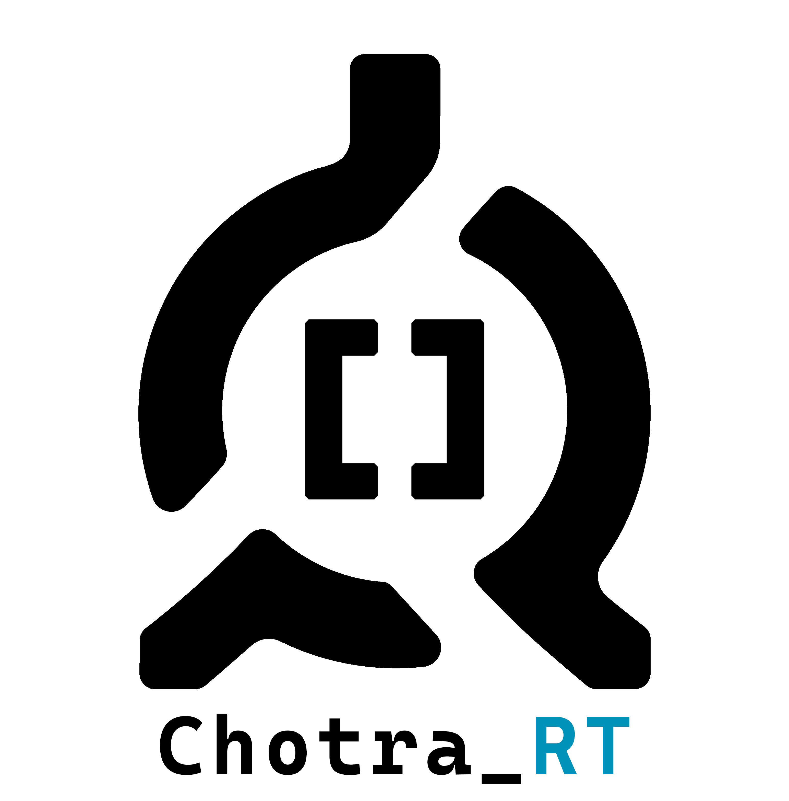
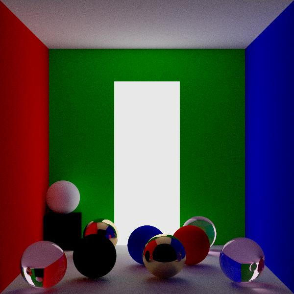
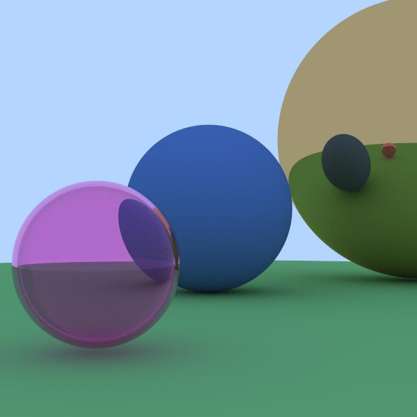

    

<h1><strong>Chotra_RT - offline 3D renderer</strong></h1>   

<h3><strong>Demo images: </strong></h3>

    

    

 
<h3><strong>
C++, CPU ray tracing. </strong></h3>

 

Dear friends.

You are probably already aware of <a href="https://github.com/Uzunig/ChotraEngine" target="_blank">Chotra Engine</a>, our real-time renderer. But the irresistible desire to learn the algorithms of ray tracing isn't gave us peace.

So, in parallel with Chotra Engine, we are launching our new project Chotra_RT, in which we'll be trying to learn the basics (and I hope not only the basics) of ray tracing.
 

Here I'll be using the C++ and Vulkan APIs, which are also worth a lot of time and attention.

We would like to meet professionals in this workspace and hope to receive feedbacks and guidances.

Regards  Igor

 
<h3><strong>My contacts:</strong></h3>

<a href="mailto:igordmitriev@gmail.com">igordmitriev.uzun@gmail.com</a>

<a href="https://www.linkedin.com/in/igor-uzun">LinkedIn</a>

<a href="https://www.github.com/Uzunig">GitHub</a>

